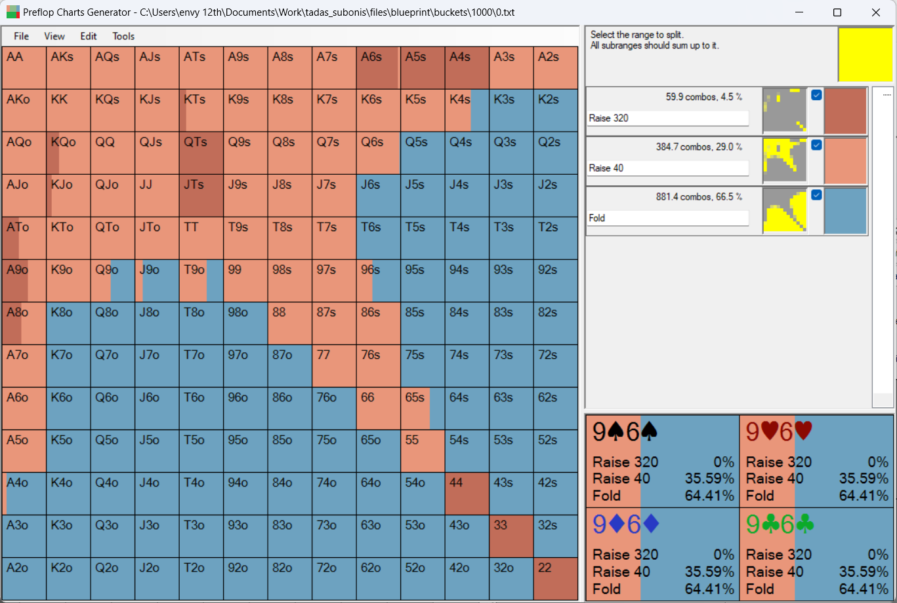
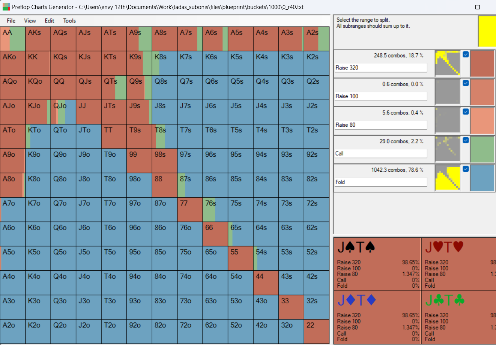
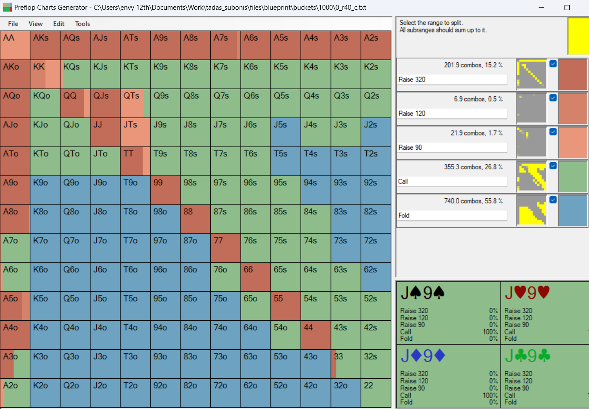

# Group Members
| No. | Name          | ID           |
|-----|---------------|--------------|
| 1   | Yared Tsegaye | UGR/8284/12  |
| 2   | Elsai Deribu  | UGR/0066/12  |


### Monte Carlo Counterfactual Regret Minimization (MCCFR)

MCCFR is an algorithm used to find approximate Nash equilibria in extensive-form games, which are games that involve sequences of moves with hidden information. The algorithm enhances traditional Counterfactual Regret Minimization (CFR) by incorporating Monte Carlo sampling methods, significantly improving efficiency by sampling the vast decision spaces typically found in these games.

At its core, MCCFR iteratively improves a strategy by minimizing regret: the difference between the reward that was actually achieved and the reward that could have been achieved with an optimal decision. Unlike CFR that requires traversing all decision nodes, MCCFR randomly samples paths in the game tree, which allows it to scale to larger games without exhaustive computation.

The key advantage of MCCFR over other game-solving approaches is its ability to efficiently handle games with a large number of possible outcomes and actions, making it particularly useful in domains like poker, where decisions are interdependent and information is imperfect.


# Poker AI Simulation

This repository contains the implementation of a Poker AI using Monte Carlo Counterfactual Regret Minimization (MCCFR) techniques. The code simulates learning strategies using self play for a simplified version of poker, including both Leduc and Kuhn variants.

## Overview

The project utilizes several Python files for managing game states, actions, card evaluations, and utilities. The main execution starts from the `learn` function which simulates learning and self play iterations for optimal poker strategies.

## Dependencies

- Python 3.x
- NumPy
- tqdm (for progress bars)

## Files Description

- `card.py`: Defines the `Card` class which represents a playing card.
- `node.py`: Defines the `MNode` class for managing game states in the CFR algorithm.
- `hand_eval.py`: Contains functions `leduc_eval` and `kuhn_eval` for evaluating hand strengths in Leduc and Kuhn poker variants.
- `util.py`: Includes utility functions such as `expected_utility` and `bias`.
- `best_response.py`: Contains the `exploitability` function to calculate how far a strategy is from being unexploitable.
- `state.py`: Contains classes `Leduc` and `State` for managing different game states.

## Usage

To run the simulation, make sure all dependencies are installed and execute:
1. Clone the repository
```bash
git clone https://github.com/Yared-betsega/monte-carlo-cfr-poker.git
```

2. Navigate to the the clone repository
```bash
cd monte-carlo-cfr-poker
```

3. Install necessary packages
```bash
pip install -r requirements.txt
```
4. After this there are two files to run
- Run the mccfr learning process. This will print out all the available states in the game and their calculated strategies(Probabilities) for optimal nash equilibrium play.
```bash
python monte_carlo_cfr.py 
```

- Run the search simulation on the terminal. (Simulation for real time playing). This will let you play the simple version of the game in the terminal. 
```bash
python search.py
```

# Outputs
The outputs of running the MCCFR on a large lever is the strategies for each node in a tree. For example we can see the following strategies generated for 
board  `KsQdTc2d4h`, flop cards being `KsQdTc`, turn cards being `2d`, and river cards being `4h`. 
Let's take a scenario with the following intial states.
- Number of players: 3
- Starting stacks for each player: 320 chips
- Small Blind: 10
- Big blind: 20

The below image shows the strategies for the first player to take. the orange colors indicate raising by 40 chips and blue colors indicate folding.
The engine gave 29% for raising and 66% for folding. This indicates that the first player should fold most of the time if this kind of situations occur.

. 


Now lets see what happens for the second player, if the first player played raise by 40.


As can be seen in the image, the engine suggests the player to fold if the first player raise by 40.


Now let's see what the last player should play if the 2nd player played call, against the AI's suggestions.


The AI suggests the third player to play call or fold with almost equal probabilities. 

# Conclusion
This is how the poker engine build with the MCCFR algorithm works. It tries to approximate the strategies to nash equilibrium strategies as in zero sum games.


